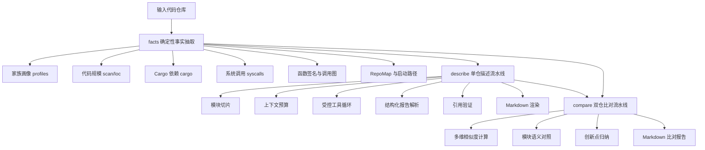

# OSKAG 设计赛道提交文档

<div align="center">

**OS-Kernel-Agent：面向小型操作系统源码的可信分析与比对智能体系统**

2026 年全国大学生计算机系统能力大赛  
操作系统设计赛 - OS 功能挑战赛道

赛题：面向小型操作系统的分析比对智能体系统设计  
题目 ID：proj18

</div>

---

## 摘要

OSKAG（OS-Kernel-Agent）是一套面向教育型、竞赛型操作系统内核源码仓库的自动化分析与比对系统。系统以命令行工具形态交付，输入单个或两个代码仓库，输出面向评审专家阅读的中文 Markdown 报告。报告内容包括仓库整体画像、模块化技术叙述、系统调用覆盖、调用图与函数签名特征、相似度矩阵、创新点归纳、源码级引用、二次验证结果和开放问题。

本项目的核心思想是将“可确定计算的事实”和“需要综合判断的语义解释”分层处理。代码行数、目录结构、Cargo 依赖、函数签名、系统调用表、启动入口、调用图等事实由确定性程序抽取；模型服务只在受控工具循环内完成跨文件取证、语义归纳和报告组织；最终由引用验证器重新读取源码，对报告中的 `file:line` 证据进行合法性与支持度检查。该架构避免将内核分析退化为普通文本生成，而是构造了一条可追踪、可复核、可复现的证据驱动流水线。

围绕赛题提出的“描述历史操作系统比赛内核作品，并将新提交作品与历史作品进行比较”这一目标，OSKAG 实现了 `facts`、`describe`、`compare`、`eval` 四类核心能力，并在 ArceOS-Starry 与 rCore-Tutorial 两类典型内核家族上完成端到端验证。系统在开发阶段生成四份单仓描述报告、六份双仓比对报告和一份自评估报告，引用合法率由修复前 96.76% 提升到 99.24%，同源 ArceOS-Starry 作品 StarryX 与 Undefined-OS 的综合相似度为 0.7028，显著高于跨家族组合，说明比对指标具备解释力。

**关键词**：操作系统内核；智能体系统；静态程序分析；源码证据；系统调用；调用图；代码相似度；引用校验；RISC-V；ArceOS；rCore

---

## 关键指标总览

| 维度 | 指标 | 结果 | 含义 |
| --- | --- | ---: | --- |
| 发布源码规模 | `.py/.j2` 文件 | 45 个 / 10897 行 | 以完整 Python 包形态交付，不是单脚本原型 |
| 核心命令 | `facts`、`describe`、`compare`、`config-check`、`chat` | 已实现 | 覆盖安装检查、事实抽取、描述、比对、模型连通性 |
| 事实抽取对象 | 四个历史内核仓库 | 4 仓 | 覆盖 ArceOS-Starry 与 rCore-Tutorial 两类主流演进路线 |
| 描述报告 | 四仓单仓 describe | 约 77K 至 90K 字符/份 | 支持启动、内存、任务、文件系统、系统调用等模块 |
| 比对报告 | 六组 compare | 平均约 12K 字符/份 | 覆盖 C(4,2) 组合，形成 4×4 相似度矩阵 |
| 引用验证 | 1052 条引用 | 1044 条合法，99.24% | 反幻觉机制具备量化证据 |
| evidence 完备性 | 179 个 diff points | A 侧 96.65%，B 侧 92.18% | 比对报告多数差异点具备两侧证据 |
| novelty evidence | 31 个 novelty diff | 100% | 创新点归纳全部携带证据 |
| 同源识别 | StarryX vs Undefined-OS | 0.7028，高度相似 | 与同属 ArceOS-Starry 家族的事实一致 |
| 缓存加速 | 同输入第二次调用 | 13.87s → 0.0165s | 约 839×，便于答辩演示与重复验证 |

---

## 目录

- [一、目标描述](#一目标描述)
- [二、比赛题目分析和相关资料调研](#二比赛题目分析和相关资料调研)
- [三、系统框架设计](#三系统框架设计)
- [四、开发计划](#四开发计划)
- [五、比赛过程中的重要进展](#五比赛过程中的重要进展)
- [六、系统测试情况](#六系统测试情况)
- [七、遇到的主要问题和解决方法](#七遇到的主要问题和解决方法)
- [八、分工和协作](#八分工和协作)
- [九、提交仓库目录和文件描述](#九提交仓库目录和文件描述)
- [十、比赛收获](#十比赛收获)
- [附录 A：主要创新点](#附录-a主要创新点)
- [附录 B：资料来源与可追溯性](#附录-b资料来源与可追溯性)
- [附录 C：运行与复现命令](#附录-c运行与复现命令)

---

## 一、目标描述

### 1.1 项目定位

OSKAG 的目标是构建一套专门服务于 OS Kernel 赛道历史作品理解与新作品比对的命令行智能体系统。系统面向的不是通用问答场景，而是高复杂度、强证据要求的操作系统源码审阅场景。它需要在大型代码仓库中识别内核家族、抽取确定性事实、定位关键模块、解释设计取舍、比较作品相似度，并将结论组织为评审专家可直接阅读的中文技术文档。

系统对外提供两条主流水线：

1. **单仓描述流水线 `describe`**  
   输入一个内核源码仓库，输出结构化中文分析报告。报告应覆盖启动流程、地址空间、任务调度、文件系统、信号、IPC、网络、驱动、系统调用等 OS Kernel 评审关心的模块，并对关键结论给出源码位置、代码片段和验证状态。

2. **双仓比对流水线 `compare`**  
   输入两个源码仓库，输出相似性与差异性分析报告。报告不只回答“像不像”，还要说明“哪里像、为什么像、哪些模块沿用了基座、哪些模块发生了实质修改、哪些差异可能构成创新点”。

### 1.2 交付目标

围绕比赛提交和答辩需求，OSKAG 的交付目标分为四层：

| 层级 | 目标 | 具体体现 |
| --- | --- | --- |
| 工具层 | 能安装、能运行、能产出报告 | `pyproject.toml` 定义包结构，`oskag` 命令作为入口 |
| 分析层 | 能识别 OS Kernel 特征 | 家族画像、syscall 抽取、启动路径、模块切片、调用图 |
| 比对层 | 能给出可解释相似度 | 函数签名、系统调用、依赖、调用图、目录结构多维融合 |
| 文档层 | 能服务评审阅读 | 中文 Markdown、目录、表格、引用索引、开放问题、验证摘要 |

### 1.3 核心约束

本项目在设计初期即明确以下约束：

| 编号 | 约束 | 工程含义 |
| --- | --- | --- |
| C1 | CLI 工具形态 | 不做 Web/IDE 插件，降低交付复杂度 |
| C2 | 中文 Markdown 输出 | 满足比赛文档与答辩材料复用需求 |
| C3 | 事实优先 | LOC、依赖、syscall、签名、调用图等必须由程序计算 |
| C4 | 强制源码引用 | 关键结论必须能回溯到 `file:line` |
| C5 | 二次验证 | 报告生成后重新读取源码检查引用合法性 |
| C6 | 比对可解释 | 相似度由多维确定性指标构成，不依赖主观判断 |
| C7 | 轻量可复现 | 避免重型编排框架，便于在评测环境安装 |
| C8 | 安全与隐私 | 配置、日志和缓存不得泄露密钥 |
| C9 | 面向 OS 专业语境 | 模块划分、术语和评分维度必须符合内核评审习惯 |

### 1.4 与普通源码总结工具的区别

普通源码总结工具通常将仓库片段输入模型并要求其“概括”。这种方式在操作系统内核场景中有三个明显风险：

- **路径幻觉**：报告中出现不存在的文件、行号或函数。
- **语义幻觉**：将标准内核知识套用到目标仓库，忽略实际实现差异。
- **比较失真**：把目录名、注释、README 文风当作主要相似度依据，无法识别家族继承与局部创新。

OSKAG 通过确定性事实层、受控工具循环、结构化输出、引用验证器和相似度矩阵将这些风险工程化压低。模型服务的角色被限制为“基于证据组织叙述”，而不是“凭印象判断源码”。

---

## 二、比赛题目分析和相关资料调研

### 2.1 赛题背景

赛题名称为“面向小型操作系统的分析比对智能体系统设计”，赛题背景指出：自 2021 年全国大学生操作系统比赛 OS Kernel 赛道开展以来，基于 RISC-V 等架构的小型操作系统作品逐年积累，技术路线覆盖 RCore/UCore 变体、ArceOS 组件化内核、微内核、宏内核、混合架构等多种形态。随着历史仓库数量增加，评审专家需要更高效地完成三类工作：

- 快速理解新提交作品的内核结构与实现重点。
- 判断新作品与历史优秀作品之间的继承、复用和差异。
- 识别真正的创新点，避免将简单移植或局部改名误判为系统创新。

这类任务天然适合智能体系统，但也天然要求强证据约束。操作系统内核不同于普通应用项目，其核心关系往往隐藏在启动入口、页表切换、trap handler、syscall dispatcher、VFS 抽象、用户态指针访问、驱动注册和调度队列之中。简单文本相似度或 README 摘要无法支撑比赛评审。

### 2.2 赛题任务拆解

赛题中的“描述”和“比较”可拆解为以下工程问题：

| 赛题要求 | 工程问题 | OSKAG 对应能力 |
| --- | --- | --- |
| 对历史 OS Kernel 作品进行描述 | 如何在大仓库中定位内核关键模块 | 家族画像、模块切片、RepoMap、受控读取 |
| 生成对人类友好的描述文档 | 如何将事实转化为评审可读报告 | 叙述式 schema、Markdown renderer、引用索引 |
| 将新作品与历史作品比较 | 如何度量两个仓库的继承与差异 | 多维相似度、模块对照、创新点证据 |
| 尽量避免幻觉 | 如何证明报告不是编造 | `file:line` 引用、验证器、precision 指标 |
| 比较文档精准无误 | 如何避免主观“像不像” | 确定性公式 + 4×4 矩阵验证 |

### 2.3 典型样本调研

开发验证阶段选取了四个历史作品作为主要样本：

| 仓库目录 | 内部名称 | 家族 | 技术基座 | 主要特征 |
| --- | --- | --- | --- | --- |
| `OSKernel2025-StarryX-3037` | StarryX | ArceOS-Starry | starry-next + arceos + axfs_ng | 组件化 workspace，`Sysno` 枚举分发，ax 系列 crate 丰富 |
| `T202510003995291-2331` | Undefined-OS | ArceOS-Starry | arceos-org/arceos | Linux 兼容导向，syscall 覆盖广，工程质量差异较大 |
| `T202510008995695-2720` | SubsToKernel | rCore-Tutorial | rCore-Tutorial-v3 ch8 | 教学内核演进，目录集中于 `os/src/*` |
| `nonix` | Nonix | rCore-Tutorial | rCore ch6 衍生 + polyhal | 支持 polyhal 抽象，体量较小但结构有改造 |

两类家族的识别依据如下：

| 家族 | 识别信号 | 典型源码特征 |
| --- | --- | --- |
| ArceOS-Starry | workspace + `register_trap_handler` + `Sysno` | `#[register_trap_handler(SYSCALL)]`、`Sysno::openat => ...`、`xapi/xcore/xmodules` |
| rCore-Tutorial | `os/src` 目录布局 + 整型 syscall 常量 | `SYSCALL_OPENAT: usize = 56`、`global_asm!`、`os/src/syscall/mod.rs` |

### 2.4 技术路线调研

最终采用“确定性程序分析 + 受控模型服务 + 结果验证”的混合架构。

| 技术方向 | 采用方案 | 原因 |
| --- | --- | --- |
| 语言与包管理 | Python 3.11+，`pyproject.toml` | tree-sitter、NetworkX、Typer 等生态成熟 |
| CLI | Typer + Rich | 命令结构清晰，终端输出友好 |
| 配置 | `.env` + pydantic settings | 支持环境变量与配置示例，便于提交 |
| 模型服务 | DeepSeek API | 符合国产模型优先取向，支持长上下文与推理 |
| 静态分析 | ripgrep、tokei、tree-sitter-language-pack、toml | 覆盖搜索、LOC、语法树、Cargo 解析 |
| 调用图 | NetworkX | 支持图节点/边相似度与后续扩展 |
| 提示模板 | Jinja2 | 模板可审计、可版本化、可跨环境复用 |
| 缓存 | diskcache | 真实调用成本可控，支持答辩重复演示 |
| 渲染 | Markdown | 便于 Git 提交、评审阅读和转换材料 |

### 2.5 调研结论

调研后形成三条关键结论：

1. **操作系统源码分析必须先建事实层**  
   如果没有 `facts.json`，模型服务很容易把常见内核知识套入目标仓库，导致报告看似专业但不可复核。

2. **比较必须多维度融合**  
   单一文本 diff 或函数签名 Jaccard 不足以判断内核继承关系。系统调用集合、依赖、目录、调用图必须共同参与。

3. **报告质量是系统能力的一部分**  
   比赛要求“人类友好”，因此排版、目录、引用索引、开放问题、验证摘要不是附属内容，而是系统交付质量的重要指标。

---

## 三、系统框架设计

### 3.1 总体架构

OSKAG 采用分层流水线架构：



该架构将系统划分为事实抽取、语义分析、比对推理、验证评估和报告渲染五个阶段。每个阶段都有明确输入输出，避免不同职责混杂。

### 3.2 发布源码模块视图

发布包 `oskag-release/oskag` 下核心源码规模为 45 个 `.py/.j2` 文件、约 10897 行。主要模块如下：

| 模块 | 代码规模 | 职责 |
| --- | ---: | --- |
| `cli.py` | 759 行 | 命令入口，组织 version/config-check/chat/facts/describe/compare |
| `llm.py` | 510 行 | DeepSeek 客户端、重试、推理参数、工具调用、缓存接口 |
| `agent.py` | 287 行 | 受控工具循环，处理工具调用、收尾重试和空响应兜底 |
| `config.py` | 272 行 | 配置读取、环境变量解析、模型参数和密钥脱敏 |
| `logging_setup.py` | 204 行 | 结构化日志与敏感字段过滤 |
| `facts/*.py` | 2796 行 | 家族画像、依赖、syscall、启动、签名、调用图、RepoMap |
| `describe/pipeline.py` | 1255 行 | 单仓描述主流程、JSON 修复、验证、综合评价 |
| `pipelines/compare.py` | 699 行 | 双仓比对、相似度融合、模块对照和创新点归纳 |
| `render/*.py` | 852 行 | 描述报告与比对报告 Markdown 渲染 |
| `eval/citation_validator.py` | 240 行 | 引用合法性验证与失败原因分类 |
| `prompts/*.j2` | 599 行 | 模块描述、比对、创新点、验证、综合评价模板 |

### 3.3 确定性事实层

事实层的设计原则是：**能由程序静态得到的内容，不交给模型估计**。其输出是后续 `describe` 与 `compare` 的共同基座。

#### 3.3.1 家族画像 `profiles.py`

`profiles.py` 负责识别仓库属于 ArceOS-Starry、rCore-Tutorial 或 unknown。识别逻辑并非只看目录名，而是组合多个信号：

- 顶层 `Cargo.toml` 是否为 workspace。
- 是否存在 `#[register_trap_handler(SYSCALL)]`。
- 是否存在 `Sysno` 枚举分发。
- 是否存在 `os/src/{syscall,task,trap}`。
- 是否存在 `SYSCALL_*` 整型常量。
- 是否存在 `define_entry!` 或 `global_asm!` 启动入口。

同时，探针会排除 `vendor/`、`arceos/`、`apps/`、`user/`、`target/` 等路径，避免依赖子仓库干扰主项目判定。例如 Undefined-OS 中存在外部代码痕迹，若不排除 `vendor/`，可能误判为 rCore 风格。

#### 3.3.2 代码规模与目录扫描 `scan.py` / `loc.py`

`scan.py` 汇总文件数、语言分布、顶层目录、工具链配置、Makefile target、Git 信息等基础事实。LOC 统计优先调用 `tokei`，不可用时回落到 Python 实现。该模块特别处理 Windows 中文路径与编码问题，避免命令行工具在中文目录下误报。

#### 3.3.3 Cargo 依赖 `cargo.py`

依赖抽取采用两级策略：

1. 优先调用 `cargo metadata --no-deps --format-version=1`，获取 workspace 成员与依赖。
2. 若目标仓库无法完整 metadata，则回落为解析所有 `Cargo.toml` 文件中的 `[dependencies]`、`[dev-dependencies]`、target 条件依赖等字段。

这种回退策略保证无法构建的竞赛仓库也能完成依赖画像。

#### 3.3.4 系统调用抽取 `syscalls.py`

系统调用是 OS Kernel 赛道作品的重要能力指标。OSKAG 为两类家族分别实现抽取路径：

| 家族 | 抽取策略 | 输出内容 |
| --- | --- | --- |
| ArceOS-Starry | 解析 `Sysno::xxx => handler` match，结合 `use` 路径定位 handler | syscall 名称、编号、handler 文件与行号、所属域 |
| rCore-Tutorial | 解析 `SYSCALL_*` 常量与 `syscall/mod.rs` dispatcher | 常量声明、分发表、handler、缺失声明告警 |

系统内置 RISCV64 与 LoongArch64 系统调用参考表，用于对齐编号与名称，防止同名不同号或同号不同名的误判。抽取后按 fs/mm/task/signal/ipc/net 等域分类，便于报告按模块叙述。

#### 3.3.5 函数签名与调用图 `signatures.py` / `call_graph.py`

函数签名用于度量 API 层相似性，调用图用于度量结构行为相似性。实现上，系统使用 tree-sitter 提取函数定义与调用表达式，再用 NetworkX 表示调用图。比对时分别计算：

- 函数签名集合 Jaccard。
- 调用图节点集合 Jaccard。
- 调用图边集合 Jaccard。
- 两者合成的 callgraph score。

调用图指标可以区分“函数名相似但调用关系不同”和“目录不同但内部调用关系接近”的情况。

#### 3.3.6 RepoMap `repomap.py`

RepoMap 是面向模型服务的紧凑仓库地图。它在约 8K token 预算内输出模块路径、关键符号和重要文件列表。RepoMap 的作用是：

- 帮助模型快速理解仓库全局结构。
- 降低无关文件进入上下文的概率。
- 为模块切片提供候选路径。
- 对未知项目提供自由章节发现依据。

#### 3.3.7 启动路径 `boot.py`

启动路径分析用于识别 `_start`、`rust_main`、`global_asm!`、`define_entry!`、平台初始化等关键入口。对 ArceOS 系，系统重点识别 axhal 平台启动链；对 rCore 系，系统重点识别汇编入口和 Rust 初始化函数。

### 3.4 单仓描述流水线

`describe` 流水线将 `facts.json` 转化为中文技术报告，核心步骤如下：

1. **模块解析**  
   对内核仓库采用固定 OS 模块序列：boot、mm、task、fs、signal、ipc、net、drivers、syscall。对未知家族项目则按目录结构启用自由模式。

2. **上下文预算**  
   `token_budget.py` 将 RepoMap、syscall 摘要、boot 摘要、文件片段按模块分配预算。质量重构后，模块上下文从 12KB 级提升到 60KB 级，文件头部行数从 200 提升到 600，以支持跨文件分析。

3. **受控工具循环**  
   `agent.py` 允许模型在白名单文件范围内主动调用 `read_file`。默认最大轮数由 6 提升到 10，以避免复杂模块在读取阶段尚未完成时被迫收尾。

4. **叙述式 schema**  
   模块输出从早期短字段改为 `narrative + refs + open_issues`。其中 narrative 负责 1500 至 2500 字分析主体，refs 给出引用索引，open_issues 标注待复核问题。

5. **JSON 容错解析**  
   `pipeline.py` 针对长 JSON 输出建立多道防线：严格解析、尾随逗号修复、截断括号补齐、字段级抢救、纯文本降级兜底。该机制解决了模块因单个 JSON 语法错误整章降级的问题。

6. **验证与渲染**  
   verifier 重读源码判断 evidence 是否支持结论，renderer 生成目录、综合评价、模块章节、引用索引、开放问题和验证摘要。

### 3.5 双仓比对流水线

`compare` 流水线建立在两个仓库的 facts 与 describe 结果之上。系统先计算确定性相似度，再让模型服务组织语义报告。

综合相似度公式为：

```text
overall = 0.30 * signature_jaccard
        + 0.20 * syscall_jaccard
        + 0.20 * dependency_jaccard
        + 0.20 * callgraph_score
        + 0.10 * directory_jaccard
```

各维度含义如下：

| 维度 | 权重 | 解释 |
| --- | ---: | --- |
| 函数签名 | 0.30 | 反映公开接口和实现骨架重合程度 |
| 系统调用 | 0.20 | 反映 Linux 兼容能力与 syscall 覆盖关系 |
| 依赖集合 | 0.20 | 反映技术栈、crate 选择和基座继承 |
| 调用图 | 0.20 | 反映函数之间的结构关系 |
| 目录结构 | 0.10 | 反映工程组织方式，但权重较低 |

判定阈值为：

| 综合分 | 判定 | 含义 |
| ---: | --- | --- |
| ≥ 0.70 | 高度相似 | 很可能存在同源基座或强继承关系 |
| 0.40 至 0.70 | 中度相似 | 存在一定共性，但模块改造明显 |
| 0.15 至 0.40 | 低度相似 | 可能同属大类，但实现差异较大 |
| < 0.15 | 基本不同 | 结构和能力均显著不同 |

### 3.6 反幻觉闭环

OSKAG 的反幻觉机制由七个环节构成：


具体机制包括：

- 引用起始行必须大于等于 1，否则整条 evidence 被丢弃。
- `_ref_lines_fix.py` 可使用 snippet 在原文件中重新定位真实行号。
- 引用验证器对每条 `file:line` 检查路径存在、行号范围和区间合法性。
- verifier 对证据支持度给出 `support / partial / contradict / unrelated`。
- 报告保留未通过项，不将失败静默删除。

### 3.7 JSON 与长上下文容错设计

长上下文模型输出结构化 JSON 时可能出现尾随逗号、截断、未转义引号、空内容等问题。OSKAG 在 `describe/pipeline.py` 与 `agent.py` 中建立多道防线：

| 防线 | 位置 | 处理问题 |
| --- | --- | --- |
| 收尾空响应重试 | `agent.py` | 工具轮数耗尽后返回空 content |
| 严格 JSON 解析 | `pipeline.py` | 正常结构化输出 |
| 尾随逗号与截断修复 | `pipeline.py` | `{"a":1,}`、括号未闭合 |
| 字段级抢救 | `pipeline.py` | refs 损坏但 narrative 仍可提取 |
| 纯文本兜底 | `pipeline.py` | 完全无法恢复结构时保住模块内容 |

在 `single_overlay` 非内核项目重跑中，该机制将模块成功率从 3/5 提升到 5/5，消除了错误章节降级标记。

---

## 四、开发计划

项目采用里程碑推进方式，每个阶段均有目标、产物和验证标准。

| 阶段 | 时间 | 目标 | 主要产物 | 验证结果 |
| --- | --- | --- | --- | --- |
| M0 | 2026-06-15 | 项目骨架与开发规范 | 计划文档、步骤文档、工作规范、初版 README | 目录与流程建立 |
| M1 | 2026-06-15 | DeepSeek 连通性与最小 CLI | `config.py`、`llm.py`、`logging_setup.py`、`cli.py` | 55 passed，smoke 4/4 |
| M2 | 2026-06-15 至 06-16 | 工具层与事实抽取 | `facts/*.py`、`tools/*.py`、`oskag facts` | 197 单元 + 27 集成通过 |
| M3 | 2026-06-16 | 单仓描述流水线 | `agent.py`、`describe/pipeline.py`、renderer | 351 单元 + 31 集成通过 |
| M4 | 2026-06-16 | 双仓比对流水线 | `compare.py`、相似度公式、比对报告 | 482 单元 + 38 集成通过 |
| M5 | 2026-06-17 至 06-23 | 质量提升、量化评估、自由模式、发布整理 | 引用验证、JSON 修复、报告重构、发布目录 | 568 passed 后继续扩展 |

### 4.1 M1：最小 CLI 与模型客户端

M1 阶段建立系统运行入口。关键工作包括：

- 读取 `.env` 配置并进行连通性检查。
- 封装 DeepSeek 客户端，支持推理参数、重试、fallback 和 usage 统计。
- 建立结构化日志，确保日志中不出现密钥原文。
- 实现 `version`、`config-check`、`chat` 三个基础命令。

### 4.2 M2：事实抽取

M2 阶段是反幻觉的根。该阶段完成双家族探针、LOC、Cargo 依赖、syscall、RepoMap、启动路径等模块，并在四个真实仓库上落盘 facts。

关键设计是“全程不调用模型服务”。事实层必须独立可信，后续报告中的数字与结构均以 facts 为准。

### 4.3 M3：单仓描述

M3 阶段将 facts 转化为中文报告。初版已能生成报告，但后续评估发现旧 schema 深度不足，因此在 M5 进行了大规模重构。重构后的 describe 流水线支持：

- 叙述式模块分析。
- 更大的上下文预算。
- 模型主动读取文件。
- 集中引用索引。
- 开放问题标注。
- 报告生成时间与源码扫描时间分离。

### 4.4 M4：双仓比对

M4 阶段完成 `compare` 主流程。关键产物包括：

- 函数签名、syscall、依赖、目录、调用图五维相似度。
- 4×4 相似度矩阵。
- 模块级 diff points。
- novelty 证据。
- Markdown 比对报告。

### 4.5 M5：质量提升与发布整理

M5 阶段围绕“可提交”进行工程加固：

- 建立 citation validator，并将引用精度量化。
- 修复 `:0-0` 假行号问题，使 Undefined-OS 引用 precision 从 86.50% 提升到 100%。
- 将旧版短句 schema 重构为 narrative schema。
- 扩展 unknown 项目的自由模式。
- 建立 JSON 修复与字段抢救机制。
- 整理 `oskag-release` 发布目录。

---

## 五、比赛过程中的重要进展

### 5.1 完成端到端工具链

系统从最初的连通性检查逐步扩展为完整代码分析工具。当前发布包支持：

```bash
oskag version
oskag config-check
oskag facts /path/to/repo
oskag describe /path/to/repo
oskag compare /path/to/repo-a /path/to/repo-b
```

其中 `facts` 不调用模型服务，适合快速获得可验证事实；`describe` 与 `compare` 在事实基础上生成报告。

### 5.2 完成双家族识别与事实抽取

开发阶段四仓事实抽取结果如下：

| 仓库 | family | 文件数 | Rust 行数 | syscall 数 | boot 风格 |
| --- | --- | ---: | ---: | ---: | --- |
| StarryX | arceos-starry | 451 | 42442 | 239 | axhal |
| Undefined-OS | arceos-starry | 424 | 36457 | 212 | axhal |
| SubsToKernel | rcore-tutorial | 243 | 64945 | 114 | global_asm |
| Nonix | rcore-tutorial | 205 | 24240 | 82 | polyhal |

该表说明系统能够识别两条主流 OS Kernel 演进路线，并抽取足够支撑后续描述与比对的事实。

### 5.3 完成四仓六对比对矩阵

四个样本形成的 4×4 综合相似度矩阵如下：

| | StarryX | Undefined-OS | SubsToKernel | Nonix |
| --- | ---: | ---: | ---: | ---: |
| **StarryX** | 1.0000 | **0.7028** | 0.2299 | 0.2959 |
| **Undefined-OS** | 0.7028 | 1.0000 | 0.2566 | 0.3237 |
| **SubsToKernel** | 0.2299 | 0.2566 | 1.0000 | 0.3558 |
| **Nonix** | 0.2959 | 0.3237 | 0.3558 | 1.0000 |

六组详细维度如下：

| 对比 | 函数签名 | syscall | 依赖 | 调用图 | 目录 | 综合分 | 判定 |
| --- | ---: | ---: | ---: | ---: | ---: | ---: | --- |
| StarryX vs Undefined-OS | 0.8375 | 0.6891 | 0.4375 | 0.7799 | 0.7020 | **0.7028** | 高度相似 |
| StarryX vs SubsToKernel | 0.2423 | 0.3591 | 0.0909 | 0.3337 | 0.0044 | 0.2299 | 低度相似 |
| StarryX vs Nonix | 0.4265 | 0.3112 | 0.1053 | 0.3041 | 0.2385 | 0.2959 | 低度相似 |
| Undefined-OS vs SubsToKernel | 0.2698 | 0.4130 | 0.1111 | 0.3543 | 0.0000 | 0.2566 | 低度相似 |
| Undefined-OS vs Nonix | 0.4627 | 0.3568 | 0.0862 | 0.3628 | 0.2377 | 0.3237 | 低度相似 |
| SubsToKernel vs Nonix | 0.2953 | 0.5833 | 0.4762 | 0.2596 | 0.0342 | 0.3558 | 低度相似 |

分析结论：

- StarryX 与 Undefined-OS 同属 ArceOS-Starry，函数签名、调用图和目录结构相似度均较高。
- 跨家族组合目录相似度接近 0，说明工程组织方式显著不同。
- SubsToKernel 与 Nonix 虽同属 rCore 路线，但目录和调用图分化明显，系统将其判定为低度相似而非简单同源复制。

### 5.4 描述报告质量重构

早期报告存在叙述短、深度不足、排版机械等问题。经诊断，根因包括：

- schema 将关键设计压缩为 30 字短句，无法承载技术取舍。
- 模块上下文预算过小，模型看不到跨文件关系。
- 工具循环轮数不足，复杂模块未完成取证就被迫收尾。
- renderer 将短句堆成列表，缺少专家报告式叙述。

重构后形成七类改动：

| 改动 | 内容 | 效果 |
| --- | --- | --- |
| schema 改造 | `key_designs` 短句改为 `narrative + refs + open_issues` | 提升分析深度 |
| 模型配置 | 复杂分析使用更强推理配置 | 提升跨文件综合能力 |
| 上下文预算 | 12KB 级提升到 60KB 级 | 支持读取更多源码 |
| 工具循环 | max turns 6 → 10 | 减少复杂模块中途收尾 |
| renderer | TOC、综合评价、上标引用、引用索引 | 提升可读性 |
| pipeline | 新字段解析、JSON 修复、字段抢救 | 减少章节降级 |
| 测试 | 568 passed | 保证重构不破坏旧能力 |

典型效果是 Undefined-OS 的 mm 单模块报告由约 600 字浅层摘要提升到 17749 字技术分析，能够讨论 ELF 加载、信号跳板、per-CPU 用户内存访问、巨页、`MAP_FIXED_NOREPLACE` 语义等具体问题。

### 5.5 引用验证精度提升

初始自评估中，4 份 describe + 6 份 compare 共 1080 条引用，其中 1045 条合法，precision 为 96.76%。失败主要集中在 `:0-0` 假行号。修复后指标为：

| 指标 | 修前 | 修后 | 变化 |
| --- | ---: | ---: | ---: |
| 总引用 | 1080 | 1052 | -28 |
| 合法引用 | 1045 | 1044 | -1 |
| 失败引用 | 35 | 8 | -27 |
| precision | 96.76% | **99.24%** | +2.48 pp |

Undefined-OS 单仓重跑结果：

| 指标 | 修前 | 修后 |
| --- | ---: | ---: |
| 引用数 | 200 | 172 |
| 合法引用 | 173 | 172 |
| 失败引用 | 27 | 0 |
| precision | 86.50% | **100.00%** |

引用数减少是预期现象：schema 严格后，模型无法再使用 `:0-0` 占位，只能输出真正可定位的引用。

### 5.6 扩展自由模式

原始系统固定面向 OS 内核模块。后续加入 `family=unknown` 自由模式：

- 按顶层目录发现模块。
- 模型服务仅负责模块中文命名，不决定模块是否存在。
- 对 C++ DSL 编译器项目 `single_overlay` 成功生成 root、parser、rewriter、dacppLib、dpcppLib 等章节。
- JSON 容错修复后，5/5 模块成功生成，无错误章节。

该扩展证明系统架构可迁移到其他系统软件项目，不是仅为四个样本仓库硬编码。

---

## 六、系统测试情况

### 6.1 测试体系

开发阶段建立了较完整的 pytest 测试体系，覆盖：

- 配置读取与密钥脱敏。
- 模型客户端参数、重试、缓存、工具调用标准化。
- 文件读取、搜索、tree-sitter 解析、LOC 统计。
- 家族识别、Cargo 依赖、syscall、boot、RepoMap。
- 函数签名、调用图与相似度计算。
- describe pipeline、JSON 修复、引用过滤、行号修复。
- compare pipeline、diff points、novelty evidence。
- Markdown 渲染和 citation validator。

### 6.2 阶段测试记录

| 阶段 | 测试结果 | 说明 |
| --- | --- | --- |
| M1 | 55 passed，smoke 4/4 | 最小 CLI 与模型连通性 |
| M2 | 197 单元 + 27 集成通过 | 事实层四仓落盘 |
| M3 | 351 单元 + 31 集成通过 | describe 流水线 |
| M4 | 482 单元 + 38 集成通过 | compare 与 4×4 矩阵 |
| M5 引用修复 | 562 passed | `:0-0` 行号漏洞修复 |
| 质量重构 | 568 passed | narrative schema 与 renderer 重构 |
| JSON 修复 | 新增 18 个 JSON repair 测试 | 尾随逗号、截断、字段抢救 |

### 6.3 引用验证结果

引用验证器检查三类问题：

- 文件是否真实存在。
- 行号是否大于等于 1 且不超过文件长度。
- 行号区间是否有序。

修后结果：

| 指标 | 数值 |
| --- | ---: |
| 总引用数 | 1052 |
| 合法引用 | 1044 |
| 失败引用 | 8 |
| citation precision | **99.24%** |

失败原因分布：

| reason_code | 数量 | 含义 |
| --- | ---: | --- |
| `file_not_found` | 4 | 路径写错或历史报告残留 |
| `line_out_of_range` | 3 | 行号超过文件长度 |
| `line_start_zero` | 1 | 未重跑产物中残留的 0 行号 |

### 6.4 evidence 完备性

双仓比对报告中，系统要求每个 diff point 尽可能带有 A/B 两侧证据。六组结果如下：

| 对比 | 模块数 | diff points | A 侧证据 | B 侧证据 | novelty 证据 |
| --- | ---: | ---: | ---: | ---: | ---: |
| StarryX vs Undefined-OS | 9 | 31 | 30/31 | 31/31 | 5/5 |
| StarryX vs SubsToKernel | 9 | 46 | 42/46 | 42/46 | 5/5 |
| StarryX vs Nonix | 9 | 32 | 32/32 | 25/32 | 6/6 |
| Undefined-OS vs SubsToKernel | 9 | 29 | 29/29 | 29/29 | 5/5 |
| Undefined-OS vs Nonix | 9 | 21 | 21/21 | 18/21 | 6/6 |
| SubsToKernel vs Nonix | 9 | 20 | 19/20 | 20/20 | 4/4 |
| **合计** | 54 | 179 | 173/179 | 165/179 | 31/31 |

综合指标：

- A 侧 evidence 完备率：96.65%。
- B 侧 evidence 完备率：92.18%。
- novelty evidence 完备率：100.00%。

### 6.5 性能与成本

开发阶段全量运行数据如下：

| 阶段 | 范围 | prompt | completion | reasoning | 时长 | 估算成本 |
| --- | --- | ---: | ---: | ---: | ---: | ---: |
| describe | 4 仓 | 1,009,563 | 113,370 | 3,461 | 22.1 min | 约 ¥1.0 |
| compare | 6 对 | 116,284 | 91,704 | 61,176 | 29.5 min | 约 ¥0.4 |
| 合计 | 4 仓 + 6 对 | 1,125,847 | 205,074 | 64,637 | 51.6 min | 约 ¥1.4 |

缓存机制使重复运行具备较高可复现性与演示效率。同输入第二次调用由 13.87s 降到 0.0165s。

### 6.6 复现说明

发布包采用精简形态，主要保留运行源码、配置示例和说明文档。开发阶段的测试目录、历史报告和过程日志不作为发布目录主内容。若在完整开发工作区运行测试，可使用：

```bash
pip install -e ".[dev]"
python -m pytest tests/ -q
```

若只验证发布包安装与命令入口，可使用：

```bash
pip install -e .
oskag version
oskag config-check
```

---

## 七、遇到的主要问题和解决方法

| 问题 | 现象 | 根因 | 解决方法 | 结果 |
| --- | --- | --- | --- | --- |
| Windows 中文路径下搜索异常 | npm 版 ripgrep 在中文路径下拒绝访问 | WASI 路径解析与 codepage 不稳定 | 改用原生 `rg.exe`，统一 UTF-8 环境 | 集成测试由约 112s 降至约 1.7s |
| 配置污染 | `config-check` 读取到非预期环境变量 | 父进程变量覆盖项目 `.env` | `.env` 解析后执行受控 override | 配置稳定可预测 |
| 早期报告浅 | 模块分析像短句列表 | schema 字段过短，上下文预算过小 | narrative schema + 60KB 上下文 + renderer 重构 | 单模块分析深度显著提升 |
| 工具循环收尾失败 | 复杂模块返回空内容 | 轮数不足，收尾仍消耗推理预算 | max turns 6→10，收尾关闭推理，空内容重试 | JSON 成功率提高 |
| `:0-0` 假行号 | 27 条 Undefined-OS 引用失败 | schema 未禁止 0 行号，pipeline 静默修正 | prompt 硬规则 + parse 阶段过滤 + Reason 枚举 | 单仓 precision 86.50%→100% |
| 行号偏移 | 引用偏 1 至 12 行 | 模型服务估计行号 | snippet grep 二次定位 `_ref_lines_fix.py` | 引用定位更稳定 |
| JSON 损坏 | 模块降级为 `json_parse_failed` | 尾随逗号、截断、未转义引号 | JSON repair、字段抢救、纯文本兜底 | `single_overlay` 5/5 成功 |
| facts schema 假设错误 | syscall/deps/loc 一度全 0 | compare 层按想象字段读取 facts | 读取真实 facts.json，增加兼容函数与单测 | 六组比对恢复正常 |
| 空集相似度误判 | 两边无数据时被算成 1.0 | Jaccard 空集约定不适合 compare 上下文 | compare 层将“无数据”视为 0 | 避免虚假高度相似 |
| Nonix syscall 漏抽 | syscall 数偏低 | 常量声明无 `pub` 修饰 | 正则从 `pub const` 扩展到 `const` | 警告 76→0，syscall 77→82 |
| 非内核项目无法分析 | 固定 OS 模块不适用编译器项目 | 模块序列强绑定内核语义 | `family=unknown` 自由模式 | 支持 `single_overlay` |
| 敏感信息泄露风险 | 日志可能出现密钥 | 普通正则无法覆盖所有形态 | 字段名过滤 + 值模式过滤 + 已知密钥字面值过滤 | trace 扫描 0 泄漏 |

这些问题的处理体现了项目的工程方法：先定位可复现根因，再进行最小可验证修复；不以提示词掩盖系统缺陷，而是在 pipeline、validator、renderer、测试层建立防线。

---

## 八、分工和协作

本项目采用“需求分析、架构设计、模块实现、测试验证、质量复核、发布整理”的工程协作方式。职责划分如下：

| 工作项 | 职责 |
| --- | --- |
| 赛题分析 | 阅读赛题，拆解描述、比较、反幻觉和精准性要求 |
| 架构设计 | 确定事实层、描述层、比对层、评估层和渲染层边界 |
| 操作系统知识建模 | 梳理 ArceOS-Starry、rCore-Tutorial 家族特征和模块语义 |
| 核心实现 | 完成 CLI、配置、模型客户端、工具循环、facts、describe、compare |
| 测试验证 | 建立单元测试、集成测试、端到端运行与引用验证 |
| 报告生成 | 输出 README、USAGE、描述报告、比对报告和提交文档 |
| 质量复核 | 检查安全、反幻觉、工程质量、测试覆盖和发布完整性 |

协作流程：

1. 每个阶段先明确目标、输入输出、完成判据。
2. 优先实现确定性事实层，再实现模型服务相关流程。
3. 每次重要改动后运行相应测试，并记录问题与修复结果。
4. 对关键报告进行抽样复核，将发现的问题转化为下一轮工程改进。
5. 发布前整理目录，去除缓存、临时报告、过程材料和不必要依赖。

该方式保证项目不是一次性脚本，而是具备持续迭代、问题闭环和质量复核的工程系统。

---

## 九、提交仓库目录和文件描述

本次提交以 `oskag-release/` 为发布目录。该目录为精简发布形态，保留运行所需源码、安装配置、使用说明和提交文档。

```text
oskag-release/
├── README.md
├── USAGE.md
├── pyproject.toml
├── LICENSE
├── .env.example
├── .gitattributes
├── .gitignore
├── check_traces.py
├── OSKAG-设计赛道提交文档.md
└── oskag/
    ├── __init__.py
    ├── __main__.py
    ├── cli.py
    ├── config.py
    ├── llm.py
    ├── agent.py
    ├── cache.py
    ├── logging_setup.py
    ├── tools/
    │   ├── fs.py
    │   ├── loc.py
    │   ├── ts.py
    │   └── _subprocess.py
    ├── facts/
    │   ├── scan.py
    │   ├── profiles.py
    │   ├── project_type.py
    │   ├── cargo.py
    │   ├── syscalls.py
    │   ├── boot.py
    │   ├── signatures.py
    │   ├── call_graph.py
    │   ├── repomap.py
    │   └── _syscall_tables.py
    ├── describe/
    │   ├── pipeline.py
    │   ├── prompts.py
    │   ├── token_budget.py
    │   ├── _modules.py
    │   └── _ref_lines_fix.py
    ├── pipelines/
    │   ├── compare.py
    │   └── _diff.py
    ├── prompts/
    │   ├── call_graph.j2
    │   ├── compare_semantic.j2
    │   ├── describe_module.j2
    │   ├── free_modules.j2
    │   ├── novelty.j2
    │   ├── synthesize.j2
    │   └── verifier.j2
    ├── render/
    │   ├── markdown.py
    │   └── compare_markdown.py
    └── eval/
        └── citation_validator.py
```

主要文件说明：

| 文件或目录 | 说明 |
| --- | --- |
| `README.md` | 项目概览、题目 ID、功能说明、安装流程与工作原理 |
| `USAGE.md` | 命令行完整使用说明，覆盖 facts、describe、compare、chat |
| `pyproject.toml` | Python 包配置、依赖声明、命令入口、开发工具配置 |
| `.env.example` | DeepSeek API 配置示例 |
| `LICENSE` | 开源许可 |
| `check_traces.py` | 发布一致性自检脚本，用于扫描内部标记、临时说明和配置残留 |
| `oskag/cli.py` | Typer CLI 入口，组织所有命令 |
| `oskag/config.py` | 配置读取、环境变量解析、模型参数 |
| `oskag/llm.py` | 模型客户端、推理参数、重试、工具调用和 usage 提取 |
| `oskag/agent.py` | 受控工具循环和收尾重试 |
| `oskag/cache.py` | 本地缓存，减少重复调用成本 |
| `oskag/logging_setup.py` | 结构化日志与敏感信息过滤 |
| `oskag/tools/` | 文件读取、搜索、语法解析、LOC 统计、子进程封装 |
| `oskag/facts/` | 确定性事实抽取层 |
| `oskag/describe/` | 单仓描述流水线 |
| `oskag/pipelines/` | 双仓比对流水线 |
| `oskag/prompts/` | Jinja2 提示模板 |
| `oskag/render/` | Markdown 报告渲染 |
| `oskag/eval/` | 引用验证与评估工具 |

---

## 十、比赛收获

### 10.1 操作系统方向收获

项目加深了对教育型操作系统内核演进路线的理解。ArceOS-Starry 与 rCore-Tutorial 虽都服务于教学与竞赛，但在工程组织、启动路径、syscall 分发、地址空间抽象、模块边界和依赖管理上差异显著。比对一个内核作品不能只看代码量或目录名，而必须结合系统调用覆盖、调用图、基座继承和模块语义。

### 10.2 程序分析方向收获

系统软件分析必须区分“事实”和“解释”。事实应由程序抽取，解释应基于事实组织。LOC、依赖、函数签名、syscall、调用图这些内容若交给模型估计，报告会失去可信基座。事实层越扎实，生成层越不容易跑偏。

### 10.3 智能体工程方向收获

模型服务在系统中不应处于无约束位置。它适合做跨文件语义归纳、设计取舍描述和报告组织，但不适合承担行号、路径、计数、依赖解析等确定性工作。通过工具白名单、上下文预算、结构化 schema、引用验证器和失败透明表，模型服务可以从文本生成组件转变为可审计的软件分析组件。

### 10.4 工程实践收获

项目迭代中最重要的经验包括：

- **schema 决定分析深度上限**。短句 schema 会限制再强的模型服务，叙述式 schema 才能承载专家分析。
- **行号必须由程序复核**。模型给出的行号即便大体正确，也常出现 1 至 12 行偏移。
- **失败信息必须保留**。`json_parse_failed`、`line_start_zero`、`unrelated` 不是需要掩盖的污点，而是驱动系统改进的诊断信号。
- **报告排版是系统能力**。目录、表格、引用索引、开放问题和验证摘要直接影响评审阅读效率。
- **发布目录需要克制**。最终提交包应聚焦运行源码与使用文档，避免将缓存、临时过程材料和开发中间产物混入。

---

## 附录 A：主要创新点

1. **事实与叙述分离**：用确定性程序抽取事实，由模型服务组织解释性文本。
2. **双家族 OS profile**：面向 ArceOS-Starry 与 rCore-Tutorial 建立不同探针和模块映射。
3. **系统调用语义抽取**：结合标准 syscall 表、枚举分发、常量表和 handler 定位。
4. **多维相似度融合**：函数签名、系统调用、依赖、调用图、目录结构共同参与评分。
5. **受控工具循环**：模型服务只能读取白名单范围内的源码文件，降低无关上下文干扰。
6. **引用驱动反幻觉闭环**：强制 `file:line`，解析阶段过滤非法行号，最终批量验证。
7. **叙述式报告 schema**：用 narrative、refs、open_issues 替代短句列表。
8. **JSON 容错与字段抢救**：针对长上下文结构化输出建立多级恢复机制。
9. **自由模式扩展**：unknown 项目按目录结构生成章节，支持非内核系统软件。
10. **发布一致性整理**：精简发布包，保留运行必需源码、配置、说明和提交文档。

---

## 附录 B：资料来源与可追溯性

本文档依据以下资料整理：

| 类别 | 文件或目录 | 用途 |
| --- | --- | --- |
| 赛题说明 | `../比赛.md` | 赛题名称、背景、任务、评审要点 |
| 发布说明 | `README.md`、`USAGE.md` | 项目定位、安装方式、命令说明、工作流程 |
| 工程配置 | `pyproject.toml`、`.env.example` | 包结构、依赖、命令入口、配置示例 |
| 源码实现 | `oskag/**/*.py`、`oskag/prompts/*.j2` | 系统架构、模块职责、算法实现 |
| 开发记录 | 阶段性日志与复核记录 | 里程碑、关键决策、问题与修复 |
| 运行结果 | facts、describe、compare、自评估报告 | 引用验证、相似度矩阵、证据完备性、性能数据 |

发布包采用精简目录，不包含历史缓存、临时报告、完整测试集和过程日志；本文档中的阶段性指标来自开发阶段保存的一手记录与运行结果。

---

## 附录 C：运行与复现命令

### C.1 安装

```bash
cd oskag-release
pip install -e .
```

### C.2 配置

```ini
DEEPSEEK_API_KEY=sk-你的key
DEEPSEEK_BASE_URL=https://api.deepseek.com
```

可参考 `.env.example`。

### C.3 检查

```bash
oskag version
oskag config-check
```

### C.4 抽取事实

```bash
oskag facts /path/to/repo
```

输出默认位于 `reports/<repo>-facts.json`。

### C.5 生成单仓描述

```bash
oskag describe /path/to/repo --max-turns 10
```

### C.6 生成双仓比对

```bash
oskag compare /path/to/repo-a /path/to/repo-b
```

### C.7 快速相似度验证

```bash
oskag compare /path/to/repo-a /path/to/repo-b --skip-llm
```

该模式只计算确定性相似度，不生成完整语义报告，适合调试与答辩现场演示。
